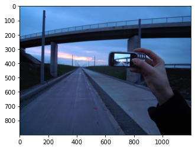
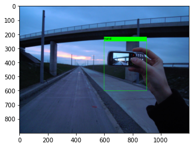

<a href="https://colab.research.google.com/github/aniketmaurya/chitra/blob/master/nbs/image-classification-example.ipynb" target="_parent"></a>

# Play with Images

> `Chitra` is an image utility class that can load image from filelike object, web url or numpy image. It offers drawing bounding box over the image.


```python
# For latest update install from master
!pip install git+https://github.com/aniketmaurya/chitra@master -q
```


```python
from chitra.image import Chitra
import matplotlib.pyplot as plt
```

## What can it do?
- Load image from file, [filelike object](https://docs.python.org/3/glossary.html#term-file-like-object), web url, or numpy array
- Plot image
- Plot bounding boxes along with labels in no extra code.
- Specify bounding box format:
       - **Center(xywh):** center x,y and height width of bbox
       - **Corner(xyxy):** xmin ymin and xmax ymax
- Plot bounding box on image

### Load image from web url and show


```python
url = 'https://upload.wikimedia.org/wikipedia/commons/thumb/b/b6/Image_created_with_a_mobile_phone.png/1200px-Image_created_with_a_mobile_phone.png'
image = Chitra(url)
image.imshow()
```





### Plot bounding box and label for the handphone


```python
b = [[600, 250, 900, 600.1]]
l = ['hand']
image = Chitra(url, b, l)
image.image = image.image.convert('RGB')
plt.imshow(image.draw_boxes())
```


    <matplotlib.image.AxesImage at 0x7fb0742e6250>





```python

```
